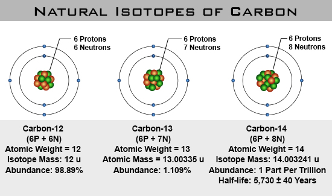

# Neutrons
Neutrons are the glue that hold the nucleus together.
They act as 'spacers' to keep the protons just enough seperated that the **nuclear forces** can overcome the **electric forces** that are trying to force the **protons** apart.

## Isotopes
**Protons** determine the element, but **neutrons** determine the **isotope**.
An **isotope** is an element that has the **atomic weight** specified.
If no number is specified, it is assumed that you are refering to a bunch of atoms, the **element**, if you specify the **atomic weight**  you are refering to an individual atom, or a collection of homogeneous atoms.

Examples:

  * Carbon is a element.
  * Carbon-12 is an **isotope** that has an **atomic weight** of 12.
  * Carbon-13 is an **isotope** that has an **atomic weight** of 13.
  * Carbon-14 is an **isotope** that has an **atomic weight** of 14.

In nature, **isotopes** occur in certain percentages depending upon how stable a given **isotope** is.

As seen above, carbon comes in 3 types, carbon-12, carbon-13, and carbon-14.
When refered to as carbon-12, just the atom that has an **atomic weight** of 12 is being refered to.
When refered to as carbon, it means that you have a mixure of all carbon isotopes in a given bulk material.

## Application - Carbon Dating
When alive living things are constantly turning over the carbon in their bodies with the carbon in their enviroment through resperation (breathing).
When they die that process nolonger happens.
This means that when alive, all things have the same percentage of carbon-14 as their enviroment.

So when something dies the carbon-14 starts to decay because it is radioactive, meaning it is unstable and will spontaneously break down at a know rate.
We can then determine how old something is by how little carbon-14 is left when we examine it.

---
# Electrons
Electrons are the tiny (relative to protons and neutrons), negatively charged, sub-atomic particles that fly around the outside of every atom.

| Mass | Charge | Location |
|------|--------|----------|
| $\approx$ 0 u | -1 | Outside |

