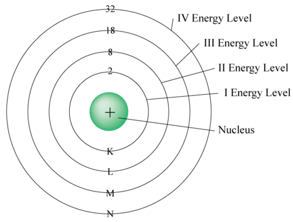
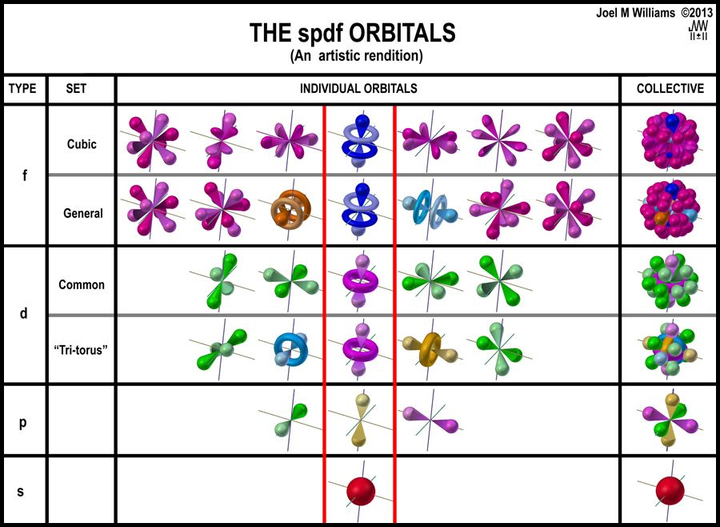
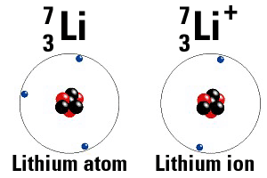

# Electrons
Electrons are the tiny (relative to protons and neutrons), negatively charged, sub-atomic particles that fly around the outside of every atom.

| Mass | Charge | Location |
|------|--------|----------|
| $\approx$ 0 u | -1 | Outside |

## Energy Levels
There are two things you need to know about electrons, they don't share their space, and they all want to be as close to the nucleus as possible. So:

  * Electrons exist in different **energy levels** because they cannot share space.
  * Electrons fill from the lowest or closest **energy level** outward because they want to be as close as possible.

One last thing about electrons.
Electrons are directionally challenged, meaning that if one travels left, and one travels right, then they don't interfer with eachother.
This means that 2 electrons can fit into each **energy level**, hence the 2 in the equation below.

Long story short, each orbital n, can hold $$\text{Electrons per obital n} = 2n^2$$
The first orbital can hold 2, the second can hold 8, the third can hold 18, and so on.

The simplest way to show the orbitals or **energy levels** is to have a central nucleus with concentric rings representing the electron orbitals.

This model is good for quick sketching but does not represent the actual locations of electrons, but does show the concept of **energy levels** very well.
In the current model, the **energy levels** are called orbitals because the locations of the electrons is no where near spherical.
Below is the current model, note how the final result is that the elctrons are packed as closely as possible to eachother and the nucleus.

## Valence Electrons
**Valence electrons** are the outermost electrons.
They are the face which the atom presents to the world, and are thus how the atom interacts with the world.
Because the electrons move so fast, the ones on the outside effectively hide or shield the outside world from seeing all the other electrons inside.

The tall columns of the periodic table, the first two and last six, indicate the number of **valence electrons**.
The first column has 1 **valence electron**, the second has 2, and so on, until the very last column has 8.

The ultimate goal of any atom is have a full set of valence electrons.
Atoms will do ANYTHING to have a full set of valence electrons.
Stealing or giving away electrons as needed.
It is easier to eject electrons if the atom is in columns 1, 2, 13.
It is easier to steal electrons if the atom is in column 15, 16, 17.
If it is in the middle, column 14, it can go either way.
If it is happy and content, column 18, then the atom will ignore everyone that passes by.

## Ions
**Ions** are any atom that have a non-zero charge.

No matter what happens to the electrons, the nucleus retains the same number of protons.
That means that if the atom throws away an electron, the atom has a net positive charge.

Example 1: Lithium is in the first column, so it wants very badly to throw away its extra electron so that it has 2 valence electrons.
When it does throw that electron away it has 3 protons and 2 electrons.
Hence the charge is now 3(+1) + 2(-1) = +1.
The atom is positive.

Ions form when either radiation knocks an electron out, or when atoms steal or give away electrons.

If an atom gives up an electron (columns 1, 2, 13) it becomes a positive ion called a **cation**.
If an atom steals an electron (columns 15, 16, 17) it becomes negative and becomes an **anion**.
The easiest way to remember which is which is to look at the prefix 'a' in **anion**.
Other examples are; amnesia, without memory; amoral, without morals; amorphous, without shape; apathetic, without feeling.
**Anions** are without charge meaning they have negative charge.

## Ionic bonds
When a neutral sodium atom sees a neutral chlorine atom, they make a trade.
The sodium atom is in colulmn 1 so it really wants to give its extra electron away.
The chlorine atom is in column 17, so it really wants an electron.
It is a win-win trade.
Once they trade though, the sodium ion is positively charged, and the chlorine ion is negatively charged.
The same **electric forces** that act within the atom now act between the two ions and pull them together forming NaCl, table salt.

